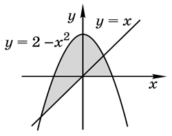

# Задача 1 - Работа с цифрами

Дано трехзначное число 𝑁. Найдите сумму его цифр и вывести следующее за ним **четное** число.
При решении этой задачи **нельзя** использовать условную инструкцию **if** и **циклы**.

## Входные данные

Вводится число 𝑁 (100≤𝑁≤999).

## Выходные данные

Выведите сумму цифр числа 𝑁 и следующее за ним **четное** число.

### Пример

---

Input: 179 \
Output: 17 180

---

Input: 829 \
Output: 19 830

---

Input: 432 \
Output: 9 434

---

# Задача 2 - Пирожки

Пирожок в столовой стоит 𝑎 рублей и 𝑏 копеек. Определите, сколько рублей и копеек нужно заплатить за 𝑛 пирожков.

## Входные данные

Программа получает на вход три числа: 𝑎 (0≤𝑎≤3000), 𝑏 (0≤𝑏≤99), 𝑛 (0≤𝑛≤3000).

## Выходные данные

Программа должна вывести в единственной строке два целых числа через пробел - стоимость покупки в рублях и копейках.

### Пример

---

Input: 10 15 2 \
Output: 20 30

---

Input: 2 50 4 \
Output: 10 0

---

# Задача 3 - Электронные часы

Электронные часы показывают время в формате **h:mm:ss**, то есть сначала записывается количество **часов**, потом
обязательно двузначное количество **минут**, затем обязательно двузначное количество **секунд**. Количество минут и
секунд при необходимости дополняются до двузначного числа нулями.

С начала суток прошло **n** секунд. Выведите, что покажут часы.

## Входные данные

Вводится целое число n.

## Выходные данные

Выведите ответ на задачу, соблюдая требуемый формат.

### Пример

---

Input: 3602 \
Output: 1:00:02

---

Input: 43300 \
Output: 12:01:40

---

# Задача 4 - Принадлежность точки отрезку

На числовой прямой даны два отрезка [−2;3] и [6;9]. Требуется определить, что точка x НЕ принадлежит ни одному из данных отрезков.

## Входные данные

Во входном потоке в единственной строке записано вещественное число x заданное не более чем с шестью знаками после точки (−1000≤𝑥≤1000).

## Выходные данные

Выведите true, если точка x **НЕ** принадлежит ни одному из данных отрезков, или false в противном случае.
### Пример

---

Input: 5.1 \
Output: true

---

Input: 7 \
Output: false

---

# Задача 5 - Хотя бы два

Даны 3 целых числа. Требуется определить, есть ли среди этих чисел хотя бы два трехзначных числа кратных 5.

## Входные данные

Во входном потоке в единственной строке через пробел записаны 3 целых числа (−10^9≤𝑥≤10^9)

## Выходные данные

Выведите true, если среди данных чисел есть хотя бы два трехнзначных числа кратных 5, или false в противном случае.

### Пример

---

Input: 100 10 200 \
Output: true

---

Input: 100 100 200 \
Output: true

--- 

Input: 100 10 20 \
Output: false

--- 

Input: 100 101 20 \
Output: false

--- 

Input: 100 101 201 \
Output: false

--- 

# Задача 6 - Принадлежность отрезку

Напишите программу, которая определяет, попала ли точка с заданными координатами в заштрихованную область, изображенную на рисунке ниже.

## Входные данные

Во входном потоке в единственной строке через пробел записаны два вещественных числа – координаты точки на плоскости, сначала координата x , затем координата y (−1000≤𝑥,𝑦≤1000). Координаты заданы не более чем с шестью знаками после точки.

## Выходные данные

Программа должна вывести слово 'YES', если точка попала в заштрихованную область, и слово 'NO', если не попала.
### Пример

---

Input: 0. 1. \
Output: YES

---

Input: 0. -1. \
Output: NO

---
